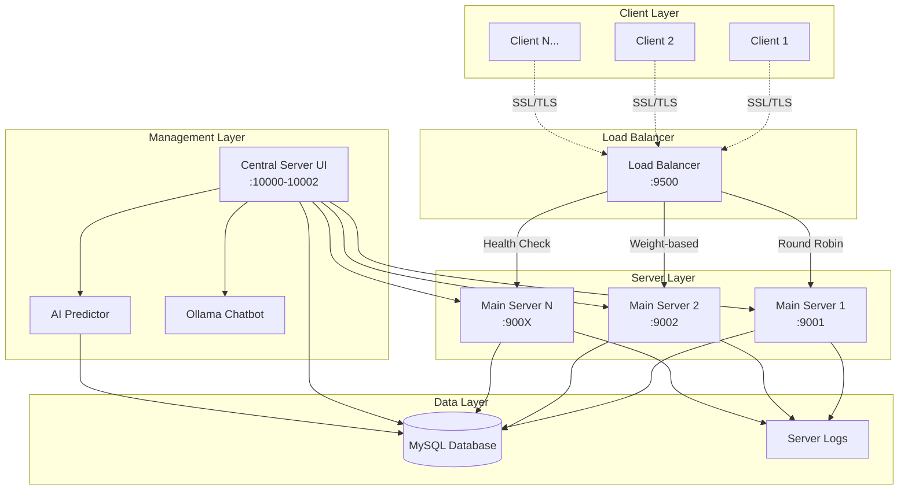

# 📡 Remote Data Collection System

<div align="center">


**Hệ thống thu thập và giám sát dữ liệu từ xa với kiến trúc phân tán**

*Đồ án môn Lập trình mạng căn bản*

</div>

---

## 📋 Mục lục

- [📖 Giới thiệu](#-giới-thiệu)
- [🏗️ Kiến trúc hệ thống](#️-kiến-trúc-hệ-thống)
- [✨ Tính năng chính](#-tính-năng-chính)
- [🔧 Cài đặt](#-cài-đặt)
- [🚀 Hướng dẫn sử dụng](#-hướng-dẫn-sử-dụng)
- [📁 Cấu trúc dự án](#-cấu-trúc-dự-án)
- [🔐 Bảo mật](#-bảo-mật)
- [📊 Cơ sở dữ liệu](#-cơ-sở-dữ-liệu)
- [🤖 Tích hợp AI](#-tích-hợp-ai)
- [⚙️ Cấu hình](#️-cấu-hình)
- [🧪 Testing](#-testing)
- [📝 API Reference](#-api-reference)
- [🤝 Đóng góp](#-đóng-góp)
- [📜 License](#-license)

---

## 📖 Giới thiệu

**Remote Data Collection System** là một hệ thống giám sát và thu thập dữ liệu phân tán được phát triển cho môn học **Lập trình mạng căn bản**. Hệ thống cho phép thu thập thông tin phần cứng, hiệu năng hệ thống từ các máy client từ xa và hiển thị thông tin theo thời gian thực thông qua dashboard web.

### 🎯 Mục tiêu dự án

- Xây dựng kiến trúc client-server với giao thức SSL/TLS
- Triển khai load balancer cho tính sẵn sàng cao
- Tích hợp cơ sở dữ liệu MySQL để lưu trữ dữ liệu
- Phát triển giao diện quản trị hiện đại với PySide6
- Ứng dụng Machine Learning để dự đoán hiệu năng
- Tích hợp chatbot AI (Ollama) hỗ trợ quản trị viên

---

## 🏗️ Kiến trúc hệ thống



### 🔧 Các thành phần chính

| Thành phần | Chức năng | Port | Giao thức |
|------------|-----------|------|-----------|
| **Client** | Thu thập dữ liệu hệ thống | - | SSL/TLS |
| **Load Balancer** | Phân tải và health check | 9500 | SSL/TLS |
| **Main Server** | Xử lý dữ liệu, cảnh báo | 9001-900X | SSL/TLS |
| **Central Dashboard** | Giao diện quản trị | 10000-10002 | TCP |
| **MySQL Database** | Lưu trữ dữ liệu | 3306 | TCP |

---

## ✨ Tính năng chính

### 🖥️ Thu thập dữ liệu Client
- **Thông tin tĩnh**: CPU, RAM, Swap, MAC Address
- **Thông tin động**: CPU usage, Memory usage, Disk usage
- **Tự động reconnect** khi mất kết nối
- **Xử lý lệnh từ xa**: Shutdown, Restart, Alert, Notify

### 🖥️ Máy chủ chính (Main Server)
- **SSL/TLS encryption** cho bảo mật
- **Đa luồng (Multi-threading)** xử lý nhiều client
- **Cảnh báo thông minh** dựa trên ngưỡng
- **Ghi log** vào file và database
- **Health monitoring** và auto-recovery

### ⚖️ Load Balancer
- **Round Robin** với trọng số
- **Health check** tự động
- **Failover** khi server down
- **Connection pooling**

### 📊 Dashboard quản trị
- **Xác thực người dùng** (Login/Register)
- **Giám sát real-time** với biểu đồ
- **Gửi lệnh điều khiển** từ xa
- **Xem logs và alerts**
- **Chat với AI assistant**

### 🤖 AI & Machine Learning
- **Dự đoán hiệu năng** hệ thống
- **Decision Tree Regression** để phân tích xu hướng
- **Ollama chatbot** hỗ trợ quản trị viên

---

## 🔧 Cài đặt

### 📋 Yêu cầu hệ thống

- **Python 3.8+**
- **MySQL Server 8.0+**
- **Windows/Linux/macOS**
- **RAM tối thiểu: 4GB**
- **Dung lượng ổ đĩa: 2GB**

### 🛠️ Cài đặt dependencies

1. **Clone repository**
   ```bash
   git clone <repository-url>
   cd Remote_Data_Collection
   ```

2. **Cài đặt thư viện Python**
   ```bash
   pip install -r requirements.txt
   ```

3. **Cài đặt MySQL Server**
   - Download từ [MySQL Official Website](https://dev.mysql.com/downloads/mysql/)
   - Tạo database: `remote_collection`
   - Cấu hình user và password

4. **Cài đặt Ollama (Optional)**
   ```bash
   # Linux/macOS
   curl -fsSL https://ollama.ai/install.sh | sh
   
   # Windows
   # Download từ https://ollama.ai/download
   
   # Pull model
   ollama pull llama3.2:3b
   ```

5. **Tạo SSL certificates**
   ```bash
   cd servers/
   openssl req -x509 -newkey rsa:4096 -keyout key.pem -out cert.pem -days 365 -nodes
   ```

### ⚙️ Cấu hình môi trường

Tạo file `.env` trong thư mục gốc:

```env
# Database Configuration
DB_HOST=localhost
DB_PORT=3306
DB_USER=root
DB_PASSWORD=your_password
DB_CHARSET=utf8mb4
DB_AUTOCOMMIT=True

# SSL Configuration
CERT_PATH=servers/cert.pem
KEY_PATH=servers/key.pem

# Server Configuration
SERVER_PORT=9999
LOAD_BALANCER_PORT=9500
```

---

## 🚀 Hướng dẫn sử dụng

### 1️⃣ Khởi tạo cơ sở dữ liệu

```bash
cd database/
python database.py
```

### 2️⃣ Khởi động Load Balancer

```bash
cd servers/
python load_balancing.py
```

### 3️⃣ Khởi động Main Servers

```bash
# Terminal 1 - Server 1
python main_server.py --port 9001 --dashboard-port 10001

# Terminal 2 - Server 2  
python main_server.py --port 9002 --dashboard-port 10002
```

### 4️⃣ Khởi động Dashboard

```bash
cd central_server/
python central_server_ui.py
```

### 5️⃣ Khởi động Client

```bash
cd clients/
python client.py
```

### 6️⃣ Truy cập Dashboard

1. Khởi động `central_server_ui.py`
2. Đăng ký/Đăng nhập tài khoản admin
3. Chọn MAC address client để giám sát
4. Xem biểu đồ real-time và gửi lệnh điều khiển

---

## 📁 Cấu trúc dự án

```
Remote_Data_Collection/
├── 📁 central_server/          # Dashboard và giao diện quản trị
│   ├── central_server_ui.py    # Giao diện chính PySide6
│   ├── auth_dialog.py          # Dialog xác thực người dùng  
│   └── AI.py                   # Module dự đoán AI
├── 📁 clients/                 # Client thu thập dữ liệu
│   └── client.py              # Client chính
├── 📁 database/               # Quản lý cơ sở dữ liệu
│   └── database.py            # Database operations
├── 📁 servers/                # Server xử lý dữ liệu
│   ├── main_server.py         # Server chính
│   ├── load_balancing.py      # Load balancer
│   ├── test_db.py            # Test kết nối DB
│   ├── cert.pem              # SSL certificate
│   └── key.pem               # SSL private key
├── requirements.txt           # Python dependencies
├── server.log                # Log file
├── .env                      # Environment variables
├── .gitignore               # Git ignore rules
└── README.md                # Documentation
```

---

## 🔐 Bảo mật

### 🔒 SSL/TLS Encryption
- Tất cả giao tiếp client-server sử dụng SSL/TLS
- Certificate tự ký cho môi trường development
- Key exchange 4096-bit RSA

### 👤 Xác thực người dùng
- Password hashing với SHA-256
- Session management
- Role-based access control

### 🛡️ Validation & Sanitization
- JSON schema validation
- SQL injection prevention với parameterized queries
- Input sanitization cho tất cả user inputs

---

## 📊 Cơ sở dữ liệu

### 📋 Database Schema

```sql
-- Static system information
CREATE TABLE static_info (
    id INT AUTO_INCREMENT PRIMARY KEY,
    mac_address BIGINT UNSIGNED UNIQUE,
    cpu_brand VARCHAR(255),
    cpu_arch VARCHAR(50),
    cpu_bits INT,
    cpu_logical INT,
    cpu_physical INT,
    memory_total BIGINT,
    swap_total BIGINT,
    timestamp TIMESTAMP DEFAULT CURRENT_TIMESTAMP
);

-- Dynamic performance data
CREATE TABLE dynamic_info (
    id INT AUTO_INCREMENT PRIMARY KEY,
    mac_address BIGINT UNSIGNED,
    cpu_usage FLOAT,
    memory_available BIGINT,
    memory_used BIGINT,
    memory_percent FLOAT,
    swap_used BIGINT,
    swap_percent FLOAT,
    disk_used BIGINT,
    disk_free BIGINT,
    timestamp TIMESTAMP DEFAULT CURRENT_TIMESTAMP,
    FOREIGN KEY (mac_address) REFERENCES static_info(mac_address)
);

-- Alert system
CREATE TABLE alerts (
    id INT AUTO_INCREMENT PRIMARY KEY,
    mac_address BIGINT UNSIGNED,
    alert_type VARCHAR(50) NOT NULL,
    alert_level VARCHAR(20) NOT NULL,
    alert_message TEXT NOT NULL,
    created_at TIMESTAMP DEFAULT CURRENT_TIMESTAMP,
    FOREIGN KEY (mac_address) REFERENCES static_info(mac_address)
);

-- Admin users
CREATE TABLE admin_users (
    id INT AUTO_INCREMENT PRIMARY KEY,
    username VARCHAR(255) NOT NULL UNIQUE,
    password_hash VARCHAR(255) NOT NULL,
    full_name VARCHAR(255) NOT NULL,
    email VARCHAR(255) NOT NULL UNIQUE,
    last_login TIMESTAMP DEFAULT CURRENT_TIMESTAMP ON UPDATE CURRENT_TIMESTAMP
);

-- Server logs
CREATE TABLE server_logs (
    id INT AUTO_INCREMENT PRIMARY KEY,
    address VARCHAR(255) NOT NULL,
    log_message TEXT,
    timestamp TIMESTAMP DEFAULT CURRENT_TIMESTAMP
);
```

---

## 🤖 Tích hợp AI

### 📈 Machine Learning Predictor

```python
from central_server.AI import AIPredictor

predictor = AIPredictor()
predictions = predictor.predict_all(mac_address=123456789, step=2)

# Output: 
# {
#   "cpu": [75.2, 78.1],    # Dự đoán 2 phút tới
#   "ram": [82.5, 85.3],
#   "swap": [45.1, 47.8]
# }
```

### 🗣️ Ollama Chatbot
- Tích hợp trong dashboard
- Hỗ trợ quản trị viên phân tích dữ liệu
- Model: `llama3.2:3b`

---

## ⚙️ Cấu hình

### 🔧 Client Configuration

```python
CONFIG = {
    "server": {
        "ip": "127.0.0.1",      # Load balancer IP
        "port": 9500            # Load balancer port
    },
    "timing": {
        "dynamic_info_interval": 5,  # Gửi dữ liệu mỗi 5s
        "shutdown_delay": 10,        # Delay trước khi shutdown
        "restart_delay": 10,         # Delay trước khi restart
        "cpu_interval": 1            # CPU sampling interval
    }
}
```

### ⚖️ Load Balancer Configuration

```python
SERVERS = [
    ("127.0.0.1", 9001, 3),  # (host, port, weight)
    ("127.0.0.1", 9002, 1),
]

MAX_CONNECTION_SERVER = {
    ("127.0.0.1", 9001): 3,  # Tối đa 3 kết nối
    ("127.0.0.1", 9002): 1,  # Tối đa 1 kết nối
}
```

### 🚨 Alert Thresholds

| Metric | Notify | Alert | Restart | Shutdown |
|--------|---------|-------|---------|----------|
| **CPU** | >50% | >70% | >80% | >90% |
| **RAM** | >50% | >70% | >80% | >90% |
| **Swap** | >50% | >70% | >80% | >90% |

---

## 🧪 Testing

### 🔍 Unit Tests

```bash
# Test database connection
cd database/
python test_db.py

# Test client functionality
cd clients/
python -m unittest test_client.py

# Test server functionality  
cd servers/
python -m unittest test_server.py
```

### 📊 Performance Testing

```bash
# Load testing với multiple clients
for i in {1..10}; do
    python clients/client.py &
done
```

### 🛡️ Security Testing

```bash
# SSL/TLS verification
openssl s_client -connect localhost:9500 -verify_return_error

# Certificate validation
openssl verify -CAfile cert.pem cert.pem
```

---

## 📝 API Reference

### 🔌 Client-Server Protocol

#### Static Info Payload
```json
{
    "payload": {
        "type": "static",
        "cpu": {
            "brand": "Intel(R) Core(TM) i7-9750H",
            "arch": "X86_64",
            "bits": 64,
            "count_logical": 12,
            "count_physical": 6
        },
        "memory": {
            "total": 17179869184
        },
        "swap": {
            "total": 4294967296
        },
        "MAC": {
            "mac_address": 123456789012
        }
    }
}
```

#### Dynamic Info Payload
```json
{
    "payload": {
        "type": "dynamic",
        "cpu": {
            "cpu_usage": 45.2
        },
        "memory": {
            "available": 8589934592,
            "used": 8589934592,
            "percent": 50.0
        },
        "swap": {
            "used": 1073741824,
            "percent": 25.0
        },
        "disk": {
            "disk_used": 107374182400,
            "disk_free": 53687091200
        },
        "MAC": {
            "mac_address": 123456789012
        }
    }
}
```

#### Server Response
```json
{
    "status": "success|error|ignore",
    "message": "Data saved successfully",
    "code": 200
}
```

#### Command Protocol
```json
{
    "mac_address": 123456789012,
    "command": "shutdown|restart|alert|notify",
    "message": "Optional message"
}
```

---

## 🤝 Đóng góp

### 🔄 Workflow đóng góp

1. **Fork** repository này
2. Tạo **feature branch** (`git checkout -b feature/AmazingFeature`)  
3. **Commit** changes (`git commit -m 'Add some AmazingFeature'`)
4. **Push** to branch (`git push origin feature/AmazingFeature`)
5. Mở **Pull Request**

### 📋 Coding Standards

- **PEP 8** compliance cho Python code
- **Type hints** cho tất cả functions
- **Docstrings** cho modules và functions
- **Error handling** với try-catch blocks
- **Logging** thay vì print statements

### 🐛 Bug Reports

Khi báo cáo lỗi, vui lòng bao gồm:

- **Môi trường** (OS, Python version)
- **Steps to reproduce**
- **Expected vs actual behavior**
- **Error logs/screenshots**

---

## 📞 Liên hệ & Hỗ trợ

- **Email**: student@university.edu
- **GitHub Issues**: [Create new issue](https://github.com/username/remote-data-collection/issues)
- **Documentation**: [Wiki pages](https://github.com/username/remote-data-collection/wiki)

---

## 🎓 Thông tin học thuật

**Môn học**: Lập trình mạng căn bản  
**Trường**: [Tên trường đại học]  
**Khoa**: Công nghệ thông tin  
**Năm học**: 2024-2025  

### 📚 Kiến thức áp dụng

- **Socket Programming** với Python
- **SSL/TLS** cho bảo mật mạng
- **Multi-threading** và concurrent programming
- **Database design** và SQL
- **GUI development** với PySide6
- **Machine Learning** với scikit-learn
- **System monitoring** với psutil
- **Load balancing** và high availability

---

## 📜 License

```
MIT License

Copyright (c) 2024 Remote Data Collection Project

Permission is hereby granted, free of charge, to any person obtaining a copy
of this software and associated documentation files (the "Software"), to deal
in the Software without restriction, including without limitation the rights
to use, copy, modify, merge, publish, distribute, sublicense, and/or sell
copies of the Software, and to permit persons to whom the Software is
furnished to do so, subject to the following conditions:

The above copyright notice and this permission notice shall be included in all
copies or substantial portions of the Software.

THE SOFTWARE IS PROVIDED "AS IS", WITHOUT WARRANTY OF ANY KIND, EXPRESS OR
IMPLIED, INCLUDING BUT NOT LIMITED TO THE WARRANTIES OF MERCHANTABILITY,
FITNESS FOR A PARTICULAR PURPOSE AND NONINFRINGEMENT. IN NO EVENT SHALL THE
AUTHORS OR COPYRIGHT HOLDERS BE LIABLE FOR ANY CLAIM, DAMAGES OR OTHER
LIABILITY, WHETHER IN AN ACTION OF CONTRACT, TORT OR OTHERWISE, ARISING FROM,
OUT OF OR IN CONNECTION WITH THE SOFTWARE OR THE USE OR OTHER DEALINGS IN THE
SOFTWARE.
```

---

<div align="center">

**⭐ Nếu dự án này hữu ích, hãy cho một star! ⭐**

**🎉 Cảm ơn bạn đã quan tâm đến dự án Remote Data Collection System! 🎉**

*Made with ❤️ for Network Programming Course*

</div>
